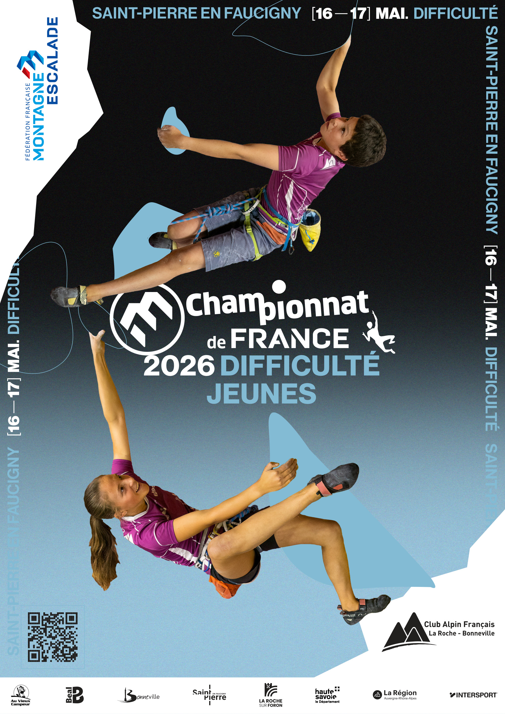

---

# ÉDITO

> _Le Championnat de France Jeunes débarque en Haute-Savoie !_
>
> C'est THE rendez-vous de l'escalade jeune en France. Plus de **300 grimpeurs** de 13 à 18 ans, l'élite nationale des catégories U15 à U19, vont en découdre sur notre mur pendant deux jours d'affrontements intenses. Objectif : décrocher le titre de **Champion de France**.
>
> Cette compétition, nous l'organisons main dans la main avec la **FFME** et le **Comité Territorial Haute-Savoie**. On a mis les petits plats dans les grands pour accueillir ces jeunes talents et leurs familles dans les meilleures conditions.
>
> Et comme notre mur fête ses **20 ans** cette année... on a décidé de faire les choses en grand : écran géant, DJ et danseurs ouvriront le bal des finales !
>
> L'entrée est **100 % gratuite**, viens vibrer avec nous !

  

    

  

---

# En bref

#### Événement

### Championnat de _France_ d’escalade de difficulté jeunes _2026_

#### Lieu

### Saint‑Pierre‑en‑Faucigny

#### Dates

### _16_ et _17_ mai _2026_

  

    

  

---

# ACCÈS & STATIONNEMENT

### LIEU DE L'ÉVÉNEMENT

_Complexe Sportif du Pays Rochois_

110 rue des Alpes 
74800 Saint-Pierre-en-Faucigny

### COVOITURAGE

  <!-- Correspond à 190 x 277/4 -->
  

    

  

---

<!-- _class: ad-page -->

  <!-- RANGÉE 1 : 1/4 de la hauteur (divisé en 2 largeur 1/2) -->
  <!-- Correspond à vos "1/8" en terme de surface (190/2 x 277/4) -->
  

    

    

  

  <!-- RANGÉE 2 : 1/4 de la hauteur (Pleine largeur) -->
  <!-- Correspond à 190 x 277/4 -->
  

    

  

  <!-- RANGÉE 3 : 1/2 de la hauteur (Pleine largeur) -->
  <!-- Correspond à 190 x 277/2 -->
  

    

  

