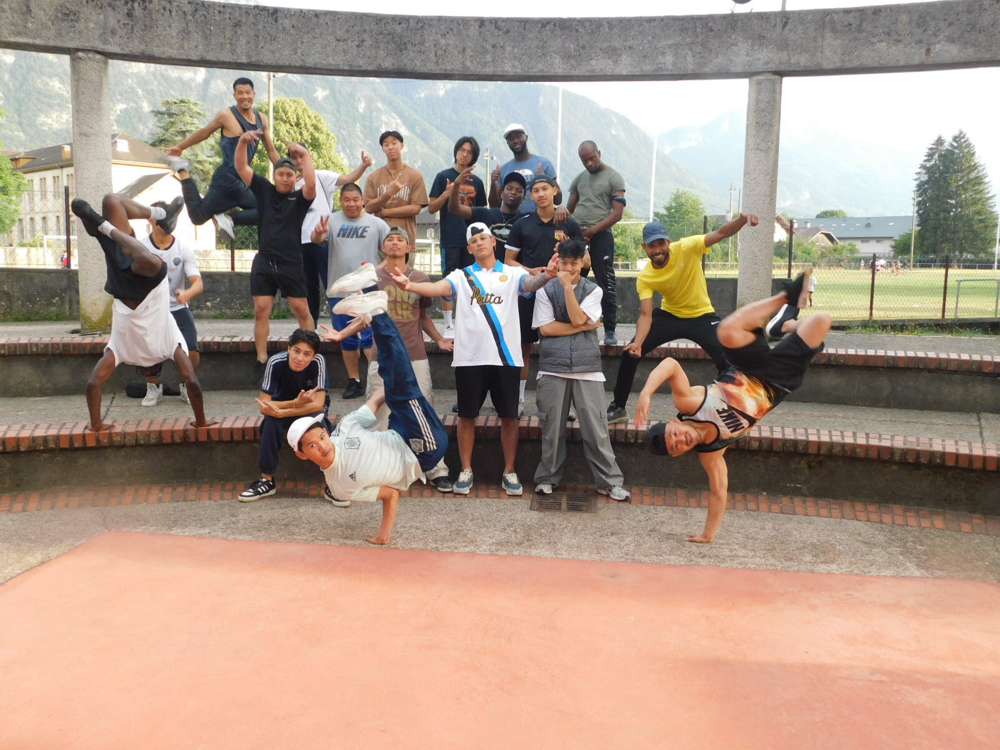

<!-- _paginate: false -->

---

---

# ÉDITO

> _Le Championnat de France Jeunes débarque en Haute-Savoie !_
>
> C'est THE rendez-vous de l'escalade jeune en France. Plus de **300 grimpeurs** de 13 à 18 ans, l'élite nationale des catégories U15 à U19, vont en découdre sur notre mur pendant deux jours d'affrontements intenses. Objectif : décrocher le titre de **Champion de France**.
>
> Cette compétition, nous l'organisons main dans la main avec la **FFME** et le **Comité Territorial Haute-Savoie**. On a mis les petits plats dans les grands pour accueillir ces jeunes talents et leurs familles dans les meilleures conditions.
>
> Et comme notre mur fête ses **20 ans** cette année... on a décidé de faire les choses en grand : écran géant, DJ et danseurs ouvriront le bal des finales !
>
> L'entrée est **100 % gratuite**, viens vibrer avec nous !

 

---

# En bref

 

#### Événement

### Championnat de _France_ d’escalade de difficulté jeunes _2026_

#### Lieu

### Saint‑Pierre‑en‑Faucigny

#### Dates

### _16_ et _17_ mai _2026_

 

#### 🤝 Organisé par

 
 

---

---

# ACCÈS & STATIONNEMENT

 

### LIEU DE L'ÉVÉNEMENT

_Complexe Sportif du Pays Rochois_

110 rue des Alpes 
74800 Saint-Pierre-en-Faucigny

### COVOITURAGE

 

 

---

# LE PROGRAMME

 

### SAMEDI 16 MAI

_Qualifications_

- _09h00 - 13h30_

  **U15 F** **U17 F** **U17 H**

- _13h45_
  Diffusion de **Vale M la montagne**

- _14h30 - 19h00_

  **U15 H** **U19 F** **U19 H**
  

  

### DIMANCHE 17 MAI

_Finales_

- _10h30_ Finales **U15**
- _12h00_ Finales **U17**
- _13h30_ Finales **U19**
- Suivi par la **Cérémonie des Podiums**

> 💥 Vibrez au rythme des _qualifications_, tremblez pendant les _finales_… et assistez à la naissance des _futures stars_ de l'escalade !

 

---

# ANIMATIONS

 

### LE SHOW

_Horsnormes_ **Break dance**

Place au show ! Les prodiges de l'asso bonnevilloise HorsNormes investissent la scène pour une démo de danse urbaine à couper le souffle. Énergie pure, acrobaties et flow dévastateur au programme.

 

### LE SON

_DJ Acrino_ **Live Mix**

Le maître des platines savoyard débarque pour retourner la salle ! Avec son mix explosif Electro, Pop et Urbain, DJ Acrino va transformer les finales en véritable festival. Impossible de rester assis !

 

### LE FILM

_Vale M la montagne_ **Projection**

Une ode à la verticalité qui va vous donner des fourmis dans les doigts ! Venez vibrer devant ce récit inspirant où le dépassement de soi rencontre la beauté brute des sommets.

### LE SON

_DJ Acrino_ **Live Mix**

Le maître des platines savoyard débarque pour retourner la salle ! Avec son mix explosif Electro, Pop et Urbain, DJ Acrino va transformer les finales en véritable festival. Impossible de rester assis !

---

# NOS ESPOIRS

 

## Ils jouent à domicile, portent nos couleurs et sont prêts à tout donner !

 

### ELIE TARDY (U15)

 
 

**3ème national** Vainqueur en régional, c'est notre plus grande chance de finale ! Sauf pépin, Elie sera aux avant-postes pour faire vibrer la salle.

### JOSUAH VEYRAT (U15)

 
 

Aux portes de l'élite (**32ème national**), Josuah peut créer la surprise. Il est dans la zone de qualification et aura besoin de vos encouragements !

### JEAN PASCARD (U17)

 
 

**34ème national** Jean est une valeur sûre. Sa constance et sa connaissance des lieux sont ses meilleurs atouts pour briller à la maison.

### PAULINE GARCIA (U19)

 
 

Déjà qualifiée aux France 4 années de suite ! Pauline est une **habituée des circuits nationaux**. Une solidité à toute épreuve pour représenter le club.

#### On soutient aussi Lou, Jade, Lalie et Antoine pour la qualif !

---

# LES RÈGLES DU JEU

 

`LE DÉFI` Atteindre le _Top_ (la dernière prise) en 6 minutes max

 

`LE SCORE` Chaque prise a un numéro. Plus tu montes, plus le numéro est gros. Ton score, c'est la _dernière prise_ que tu as contrôlée

 
 

## QUALIFS : MODE "FLASH"

 

- **2 voies** 1 seul essai par voie.

- **DÉMO** Accès libre aux vidéos

 
 

## FINALE : MODE "À VUE"

 

- Les **8 meilleurs** uniquement.
   

- **Isolement** : interdiction de voir les autres.

- **6 minutes** de lecture collective.
   

 

#### `TOUT COMPRENDRE` 

---

# LE DICO DU SPECTATEUR

### Pour comprendre ce dialecte tribal et briller à la buvette !

 

`Avoir les bouteilles` ou `Être daubé` Quand tes avant-bras sont durs comme du béton et que tes mains décident de faire grève sans ton accord.

`Le Bac` La prise canapé, grosse et rassurante. Le seul endroit de la voie où tu peux reprendre ton souffle (et ta dignité).

`La Réglette` L'inverse du bac. Une petite barrette horizontale, à peine assez profonde pour y poser le bout des doigts.

`L'Aplat` Une prise toute ronde, fuyante, sans aucun rebord pour accrocher les doigts. C'est comme essayer de tenir un ballon de basket à une main.

`Le Volume` Ces grosses structures géométriques (pyramides, cubes...) vissées sur le mur qui changent son relief.

`Le Drapeau` Le grimpeur tend une jambe dans le vide, croisée derrière l'autre jambe d'appui. Ça évite de tourner comme une porte de saloon.

`La Lolotte` Tordre son genou vers le bas de façon inquiétante pour se coller au mur. Ton orthopédiste déteste, mais tes bras adorent.

`Le Jeté` Mode kangourou activé. Tu lâches tout et tu sautes vers la prochaine prise en priant pour que ça tienne.

`Le Crux` C'est LE passage clé. Le moment le plus difficile de la voie.

 

#### `TOUT COMPRENDRE` 

---

# TROUVE TON CLUB

 

`Envie de grimper toute l'année ?`
`L'escalade, c'est encore mieux en club !`

 

### LA FFME

La référence pour apprendre, progresser techniquement et se dépasser, de l'initiation à la compétition.

_Trouve un clubs FFME_

### LA FFCAM

L'esprit 'Club Alpin' pour grimper en toute convivialité et découvrir la montagne sous toutes ses formes.

 

_Trouve un clubs FFCAM_

---

# NOS PARTENAIRES

 

### PARTENAIRES OFFICIELS

 
 

### PARTENAIRES DU CLUB

 
 

### PARTENAIRES INSTITUTIONNELS

 

---

# EXEMPLE DE LAYOUTS

  <!-- 1 ligne : 2 pub 1/8 -->
  

    
    
  

  <!-- 1 ligne : 1 pub 1/4 -->
  

  <!-- 1 ligne : 1 pub 1/2 -->
  

